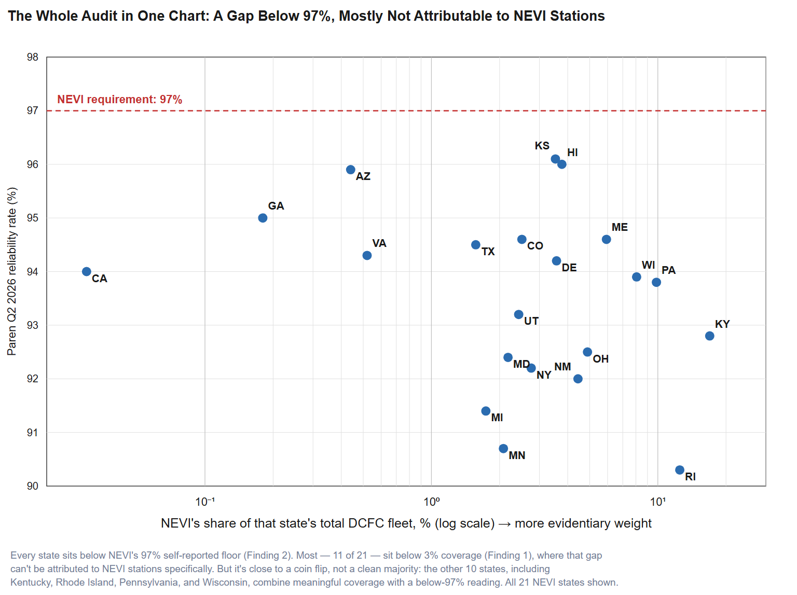
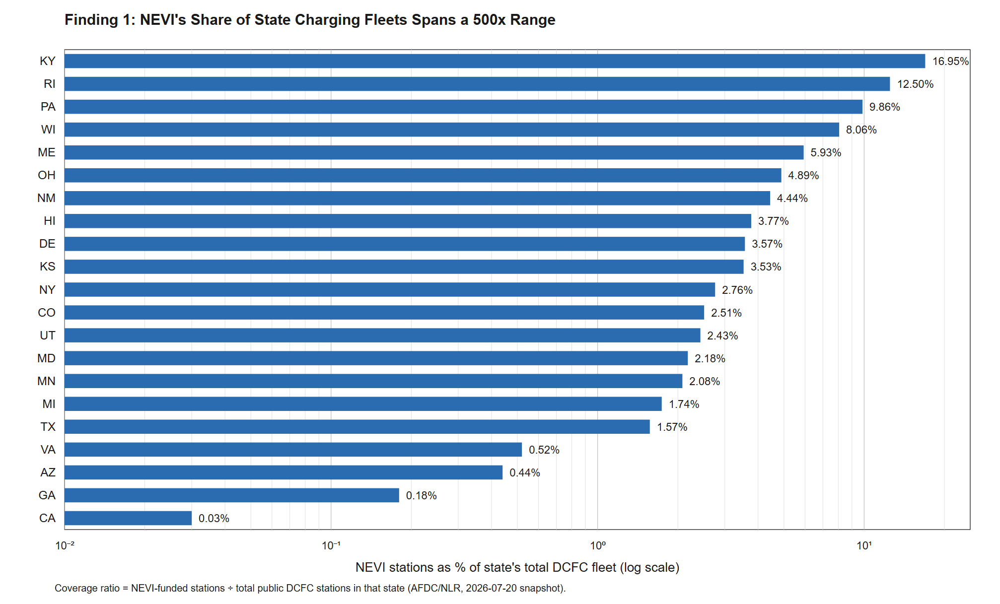
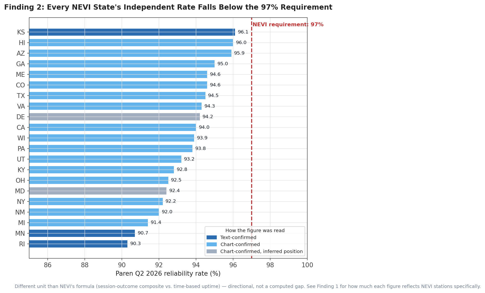
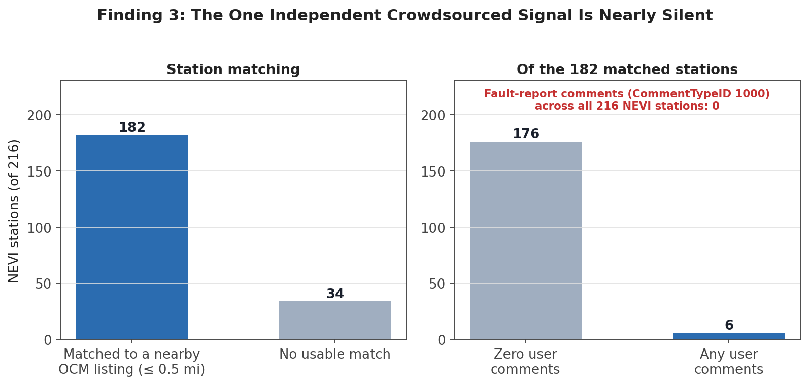

# Auditing NEVI's 97% Uptime Claim: What Public Data Can (and Can't) Tell Us

## Exec Summary

The National Electric Vehicle Infrastructure (NEVI) program has directed up to $5 billion in federal formula funding toward EV fast-charging buildout since 2022, contingent on funded stations self-reporting an average annual uptime of 97% per port to FHWA via a tool called EV-ChART. In February 2025, FHWA froze roughly $2.74 billion in unobligated NEVI funds and rescinded prior state plan approvals; a federal court ordered a partial restart in June 2025, FHWA issued revised interim guidance that August, and a court found in January 2026 that the freeze itself had been unlawful. Through all of that upheaval, one thing didn't change: the 97% uptime requirement, self-reported with no independent verification mechanism, survived intact.

I set out to test whether independent public data could verify that claim specifically for NEVI-funded stations, using only free, publicly available sources — federal station data, a commercial reliability index's published aggregates, and a crowdsourced charging-station platform. The honest answer, after building and checking three independent signals against 216 NEVI-funded stations, is more limited than I expected going in: adequate public, station-level data to verify the claim mostly doesn't exist yet. Where a comparison is possible at all, NEVI-funded stations' share of a state's total DC fast-charging fleet ranges from 0.03% in California to 16.95% in Kentucky — a roughly 500x spread — with a median across all 21 NEVI states of 2.76%. That median undersells how split the picture actually is: 11 of 21 states sit below 3% coverage, where the closest available third-party number is barely a measurement of NEVI stations at all, but the other 10 — including Pennsylvania and Wisconsin, two of the states with the most NEVI-funded stations — sit high enough that the comparison carries real, if still partial, evidentiary weight.

That's not nothing. It's a finding in its own right: the same self-reporting mechanism that survived a year of litigation intact still has no independent way to check it, at the specific stations it governs, using data available to the public today.

This project was researched and built in collaboration with Claude (Anthropic), used throughout for data collection, validation, and drafting. All conclusions, interpretations, and any mistakes are mine alone.

All the code, data, and the interactive prototype are available [here](https://github.com/jaksanders/NEVI-self-reporting-gap). You can browse the state-by-state comparison directly [here](https://nevi-self-reporting-gap-i4u4.vercel.app/).

## Background: Why Now

NEVI is a $5 billion formula program under the Bipartisan Infrastructure Law, funding EV fast chargers along designated Alternative Fuel Corridors from FY2022 through FY2026[1](#ref-1). To receive and keep that funding, each NEVI-funded charging port must maintain an average annual uptime greater than 97%, self-reported quarterly through EV-ChART[2](#ref-2).

In February 2025, FHWA paused new NEVI obligations and rescinded prior state plan approvals pending revised guidance, freezing approximately $2.74 billion in unobligated funds across FY2022–2025[3](#ref-3). Several states sued. In June 2025, a federal court ordered FHWA to resume obligations for the plaintiff states, and in January 2026 a court granted summary judgment finding that DOT and FHWA had acted unlawfully in freezing the program in the first place[4](#ref-4). FHWA released new Interim Final Guidance in August 2025 that loosened some structural requirements — narrower plan review scope, no more fixed 50-mile station spacing, simpler "fully built out" certification — but was explicit that "minimum standards for power, number of ports, uptime, payment, data and reporting, and interoperability still apply. Data will continue to flow via EV-ChART for reporting."[5](#ref-5) $885 million in FY2026 funds have since been apportioned to states, though a House-passed 2026 budget resolution has also proposed roughly half a billion dollars in cuts to the program[6](#ref-6).

So the compliance mechanism this project audits isn't a settled, decade-old rule — it's a requirement that just survived a year of program upheaval, litigation, and a guidance rewrite completely unchanged. That's the "why now."

## Prior Work

This isn't the first time someone has checked EV charging self-reports against reality, and it shouldn't be presented as if it were. Four pieces of prior work are directly relevant, and I want to name them up front rather than have a reader discover them later:

- **Liu, Francis, Hollauer et al. (2023)**, *Communications in Transportation Research*[7](#ref-7), trained a model on ten years of multilingual consumer charging reviews (2011–2021) to derive a station-level "functionality ratio," and found government-owned stations less reliable than private ones, with networked stations 5.1% more reliable than non-networked. This is the closest academic precedent for "public/crowdsourced data reveals a reliability gap." My contribution is a different signal type (structured federal metadata plus a commercial reliability index, not review text) and a different unit of analysis (regulatory compliance for a specific federal program, not general consumer sentiment).
- **Rempel, Cullen, Bryan & Cezar**, published in *Human Factors*[8](#ref-8), did field testing of 655 DCFC ports across 182 Bay Area stations and found 73.3% functional — directly conflicting with the 95–98% uptime the EV service providers themselves reported for those stations. Their own conclusion calls for "shared, precise definitions of and calculations for reliability, uptime, downtime, and excluded time... with verification by third-party evaluation." This project is one attempt at that verification, applied to a federal program specifically.
- **ChargerHelp's 2025 Annual Reliability Report**[9](#ref-9), built on 100,000+ charging sessions across 2,400 chargers with Plug In America and Paren, found that first-time charge success rates fall from roughly 85% at new stations to below 70% by year three — evidence that uptime alone masks a real gap that grows with station age.
- **"Beyond Uptime"**[10](#ref-10) makes a related argument that annual uptime is an insufficient operator-facing metric, proposing new metrics like Fault Time and a "zombie charger" case study of stations that flap between reported states. This project doesn't propose new operator metrics; it applies the audit lens above specifically to NEVI's regulatory compliance mechanism, using public data.

Nobody, as far as I can find, has scoped the self-report-vs-reality question specifically to NEVI-funded stations using public data. That's the contribution I set out to make. Whether it's actually deliverable with the data available is the subject of the rest of this piece.

## Data Sources

- **AFDC/NLR Alternative Fuel Stations API** (formerly hosted by NREL; the lab was renamed the National Laboratory of the Rockies under DOE in December 2025), filtered to `funding_sources: NEVI`. This returned 216 stations as of the 2026-07-20 snapshot used throughout this piece — a point-in-time count that will drift as NEVI's post-freeze buildout continues.
- **Paren's Q2 2026 US EV Fast Charging Report**[11](#ref-11), published July 14, 2026 — a state-by-state "Average DCFC Reliability Rate" map, drawn from Paren's published claim of 100M+ daily charging events covering 95%+ of US DCFC infrastructure. This is Paren's free published aggregate; I didn't scrape their paid session-level API.
- **OpenChargeMap**, a crowdsourced charging-station directory with user check-ins and fault reports, queried per-station via their public API.

## Methodology

### Reading Paren's State Map

Paren's Q2 2026 figures live in a chart image, not machine-readable text, so extracting them required care rather than assuming precision. I sorted every state's figure into one of three confidence tiers: **text-confirmed**, where the exact number appears in the report's prose; **chart-confirmed**, where it's an inline label directly on the state's shape; and **chart-confirmed, inferred position**, for two states (Maryland and Delaware) too small on the map for an inline label, whose figures came from a fan-out callout line. For those two, I traced each callout line pixel-by-pixel back to the shape it touches and checked the full set of nine lines in that region of the map for crossings before assigning values — Rhode Island's traced value matched a figure independently stated in the report's prose, which cross-validated the method. Kansas had a small (0.1 point) discrepancy between its prose figure and its chart label; I used the prose figure, on the reasoning that text extraction has less room for misreading than a small on-chart label. All 21 NEVI states ended up chart- or text-confirmed, with zero left unconfirmed.

### Matching Stations to OpenChargeMap

I queried OpenChargeMap for all 216 NEVI stations at a 1-mile radius, matched on nearest point-of-interest within 0.5 miles. 182 of 216 matched (average match distance 0.038 miles); 26 had no POI within a mile at all, and 8 had a nearest match beyond 0.5 miles and were left unmatched rather than force-paired. Five random spot checks against full street address and coordinates confirmed correct same-site pairing, including two cases where OpenChargeMap's listed name differs from AFDC's but the address and coordinates agree.

## Finding 1: NEVI's Share of Each State's Charging Fleet Varies by 500x

This is the finding that most changed how I'd frame the rest of the project, and it came from a check I should have run earlier: what fraction of each state's *total* public DC-fast-charging fleet do the NEVI-funded stations actually represent? Every AFDC pull up to this point had already been filtered to NEVI-funded stations only, so there was no denominator to compare against.

Pulling total DCFC station counts per state (same AFDC/NLR API, no funding filter) for all 21 NEVI states gives this:

| State | NEVI stations | Total state DCFC stations | NEVI's share |
|---|---|---|---|
| Kentucky | 20 | 118 | 16.95% |
| Rhode Island | 6 | 48 | 12.50% |
| Pennsylvania | 42 | 426 | 9.86% |
| Wisconsin | 20 | 248 | 8.06% |
| Maine | 8 | 135 | 5.93% |
| Ohio | 22 | 450 | 4.89% |
| New Mexico | 8 | 180 | 4.44% |
| Hawaii | 2 | 53 | 3.77% |
| Delaware | 2 | 56 | 3.57% |
| Kansas | 3 | 85 | 3.53% |
| New York | 21 | 762 | 2.76% |
| Colorado | 13 | 518 | 2.51% |
| Utah | 5 | 206 | 2.43% |
| Maryland | 8 | 367 | 2.18% |
| Minnesota | 7 | 336 | 2.08% |
| Michigan | 10 | 575 | 1.74% |
| Texas | 14 | 893 | 1.57% |
| Virginia | 2 | 382 | 0.52% |
| Arizona | 1 | 225 | 0.44% |
| Georgia | 1 | 562 | 0.18% |
| California | 1 | 2,877 | 0.03% |

Paren's state-level reliability rate is, by its own description, a measurement of essentially the whole state's DCFC fleet — not a NEVI-specific number. In California, where one NEVI station sits alongside 2,876 others, the state's Paren figure is a measurement of everything except, almost entirely, the NEVI station in question. In Kentucky, where NEVI stations are 17% of the state total, the same figure carries real, if still partial, weight. Between those two extremes is roughly a 500x range in how much evidentiary weight the "gap" comparison actually carries, state by state — and that range isn't visible unless you go looking for the denominator, which is exactly what didn't happen until this check. Across the full set of 21 states, it's close to a coin flip: 11 sit below 3% coverage, 10 sit at or above it — and the higher-coverage group includes some of the largest NEVI deployments by station count (Pennsylvania at 42 stations, Ohio at 22, Kentucky and Wisconsin at 20 each), so the comparison isn't uniformly weak across the dataset, just uneven state by state.

There's also a plausible population mismatch independent of size: NEVI stations are systematically newer than a state's broader DCFC fleet, since NEVI funding only began in 2022 and specifically targets highway-corridor gaps, while the wider fleet includes a long tail of older, often urban installations (car-dealership chargers dating to 2011–2012 turned up repeatedly in the raw AFDC records). Newer and older infrastructure may have systematically different reliability profiles in either direction. I haven't tested this, and I'm flagging it as a plausible confound, not a finding.

## Finding 2: Where the Comparison Holds Up at All, It's Directional, Not a Computed Gap

Even setting the coverage problem aside, NEVI's uptime requirement and Paren's reliability rate aren't measuring the same thing, and there's no clean conversion between them.

NEVI's EV-ChART formula is time-based, per port, calculated as `uptime% = (total hours − downtime hours) / total hours × 100`, with a 97% annual average minimum. Paren's Reliability Index is a proprietary composite of four session-level outcomes — clean success, success-with-retry, failed attempt, and downtime — which is a different construct measuring something closer to the ChargerHelp report's "first-time success" concept than a clock-time percentage. A station or state could plausibly satisfy NEVI's formula while producing a meaningfully lower Paren rate, or vice versa, because the two aren't in the same unit.

So rather than compute a single converted "gap" number, the comparison in the prototype is directional: NEVI's flat 97% self-reported requirement, next to what an independently measured, differently defined metric suggests, for the 21 states where NEVI has funded stations. Paren's Q2 2026 rates for those states range from 90.3% (Rhode Island) to 96.1% (Kansas) — every one below NEVI's 97% floor, but for the reasons in Finding 1, that gap can't be attributed to the NEVI-funded stations specifically with any confidence in most of those states.

The full state-by-state table, with confidence tiers and coverage context, is in the [interactive prototype](https://nevi-self-reporting-gap-i4u4.vercel.app/).

## Finding 3: The One Independent Crowdsourced Signal Available Has Almost Nothing to Say

Of the three signals this project set out to combine, OpenChargeMap was meant to be the genuinely independent one — user check-ins and fault reports aren't operator-submitted the way AFDC status codes and NEVI's own EV-ChART figures are. It came back essentially empty. Across all 216 NEVI stations, matched or not, there are **zero** fault-report comments (OpenChargeMap's own `CommentTypeID 1000`, confirmed from their reference data rather than guessed at from keywords). 176 of the 182 matched stations — 97% — have zero user comments of any kind.

I can't confirm why. It's plausible that NEVI stations skew newer and lower-traffic than the fleet OpenChargeMap's userbase mostly reports on, or that a meaningful share of drivers at Tesla-network NEVI sites use Tesla's own app instead of OpenChargeMap. Either way, the matching pipeline itself is validated (spot-checked, correct site pairing), so this is a real result about the signal's availability, not a pipeline bug.

## What Didn't Pan Out

Before landing on the coverage-ratio check and the OpenChargeMap pull, I tested one other cheap proxy: whether AFDC's own `date_last_confirmed` field — how recently an operator updated a station's listing — correlated with the size of the self-report-vs-Paren gap at the state level, on the theory that less-maintained listings might track less-reliable stations. It didn't. Pearson's r ranged from -0.09 to -0.37 depending on filtering — weak, and the wrong sign relative to the hypothesis. I'm reporting this the same way I'd report an underperforming model: plainly, not as a footnote to bury.

A fourth signal — a daily automated pull of AFDC's own station status, building a time series to detect stations that flap between reported states (a "reporting hygiene" diagnostic borrowed from the Beyond Uptime paper) — is deployed and collecting data, but needs several more weeks of accumulated snapshots before it has anything to say, and even once it does, it's measuring operator-submitted status, not an independent signal, so it can only ever support the audit, not settle it on its own.

## Conclusion

I set out to test whether NEVI's self-reported 97% uptime claim holds up against independent public data, specifically for the stations that claim governs. It doesn't cleanly resolve either way, and I think that's the honest finding rather than a disappointing one: for most of the 21 states with NEVI-funded stations, adequate independent, station-level data to make that comparison doesn't exist in public form today. The one crowdsourced channel that could have supplied it is nearly silent. The one commercial aggregate that could have supplied it is diluted by non-NEVI stations to varying degrees I hadn't originally checked for, ranging from negligible dilution in a handful of states to near-total dilution in most.

What does hold up, unaffected by any of this: NEVI requires 97% self-reported uptime with no independent reconciliation built into the compliance mechanism, that requirement survived a year of litigation and a guidance rewrite completely intact, and there is currently no adequate public, station-level dataset to check it. That's a narrower claim than "here's the gap," but it's one I can actually stand behind.

## Future Work

- Decide whether OpenChargeMap's near-total silence belongs in the prototype as a minor supporting data point, or gets dropped as a dead signal.
- Let the daily AFDC status collector accumulate enough history (several more weeks) to test for status-flapping patterns, with the operator-submitted-data caveat carried forward explicitly.
- Add the coverage-ratio finding as a visible column or caveat in the interactive prototype, not just this write-up, so a reader in California and a reader in Kentucky aren't shown the same implicit confidence in their state's number.
- Revisit whether a manually curated subset of higher-count networks (Electrify America, ChargePoint, eVgo, Tesla, FCN, Kwik Charge — the only six with double-digit NEVI station counts) could support a limited network-level view, even though a full network-level comparison isn't supportable with current public data.

## References

1. [Alternative Fuels Data Center: National Electric Vehicle Infrastructure (NEVI) Formula Program](https://afdc.energy.gov/laws/12744)
2. [NEVI Interim Final Program Guidance, FHWA, August 11, 2025](https://www.fhwa.dot.gov/environment/nevi/resources/NEVI-Interim-Final-Program-Guidance-8-11-2025.pdf)
3. [NEVI Guidance: What's changed, and what's next — Atlas EV Hub, August 25, 2025](https://www.atlasevhub.com/weekly-digest/nevi-guidance-whats-changed-and-whats-next/)
4. [Federal Judge Rules DOT Illegally Withheld NEVI Funds — ACT News](https://www.act-news.com/news/judge-rules-dot-illegally-withheld-nevi-funds/)
5. [NEVI Interim Final Program Guidance PDF, FHWA](https://www.fhwa.dot.gov/environment/nevi/resources/NEVI-Interim-Final-Program-Guidance-8-11-2025.pdf)
6. [The United States of NEVI — ACT News](https://www.act-news.com/news/the-united-states-of-nevi/)
7. Liu, S., Francis, J., Hollauer, C., et al., "Real-world data reveal the spatiotemporal, contextual, and equity dimensions of EV charger reliability," *Communications in Transportation Research*, 2023. [https://doi.org/10.1016/j.commtr.2023.100095](https://doi.org/10.1016/j.commtr.2023.100095)
8. Rempel, D., Cullen, C., Bryan, M. M., & Cezar, G. V., "Reliability of Open Public Electric Vehicle Direct Current Fast Chargers," *Human Factors*, 2024. [https://journals.sagepub.com/doi/abs/10.1177/00187208231215242](https://journals.sagepub.com/doi/abs/10.1177/00187208231215242)
9. [ChargerHelp 2025 Annual Reliability Report](https://www.chargerhelp.com/2025-annual-reliability-report/)
10. "Beyond Uptime: Actionable Performance Metrics for EV Charging Site Operators," arXiv:2601.10861
11. [Paren US EV Fast Charging Report, Q2 2026](https://paren.app/reports/us-ev-fast-charging-q2-2026)
12. [Project code, data, and prototype source — GitHub](https://github.com/jaksanders/NEVI-self-reporting-gap)
